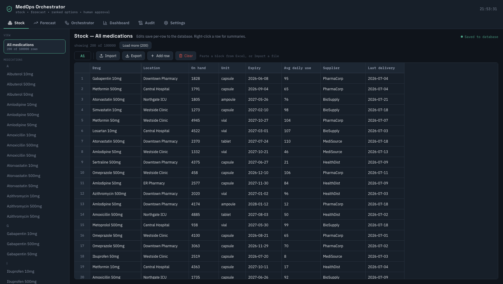
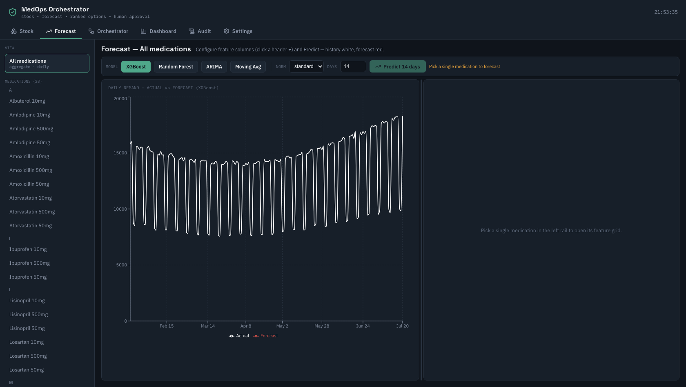
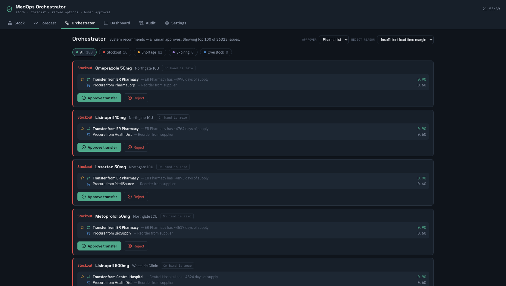
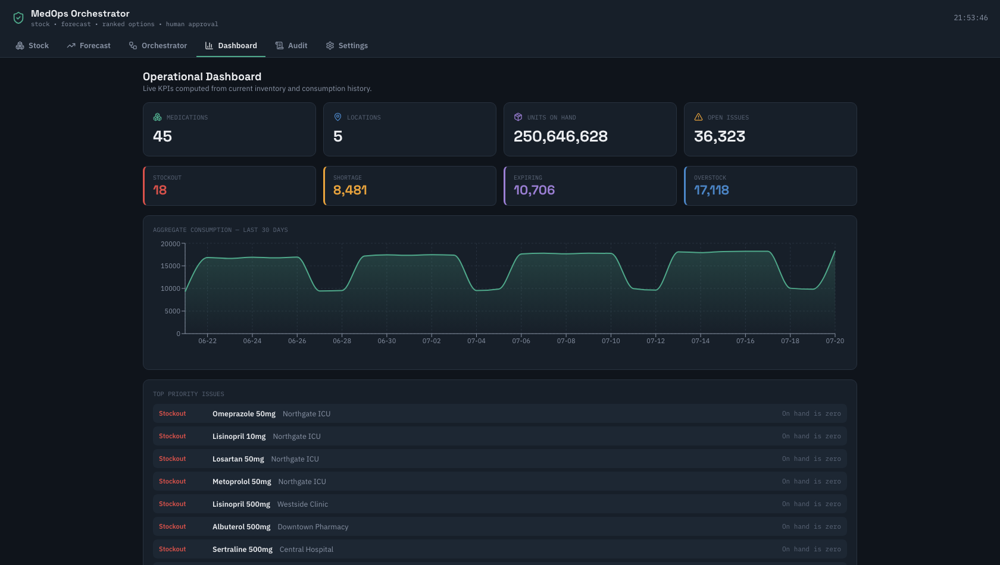
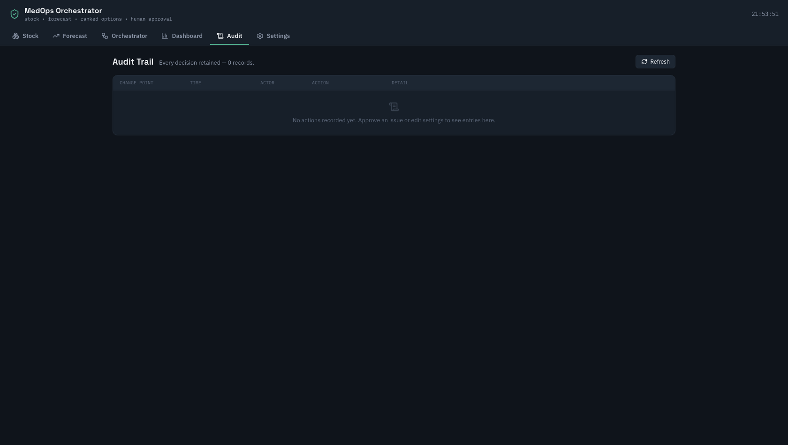

# MedOps Orchestrator

**AI-driven medication operations and task management platform** — detects
medication shortages, excess inventory, expiration risk, and supplier issues;
forecasts demand with configurable ML models; ranks operational responses
(transfer preferred over procurement); and requires **human approval before any
task executes**.

> Prototype only. Not a production medical device, not an autonomous purchasing
> system. All data is synthetic; no PHI.

## Screens

### Stock — Excel-like inventory at 100K rows
Paginated worksheet backed by SQL: import/export `.xlsx`, paste blocks straight
from Excel, per-row saves, and right-click per-drug summaries. Stored
relationally with an HL7 FHIR `InventoryItem` view (`/api/v1/fhir/InventoryItem`).



### Forecast — configurable feature grid + ML models
Two years of daily consumption history. The right-hand table **is the feature
editor**: columns are the features — click a header (▾) to set a categorical
encoder (one-hot / ordinal / **embedding with n_dims**), a lag range
(N-1…N-n), a calendar kind, or a derived formula column. Predict runs
**XGBoost / Random Forest** (multivariate, with normalization) or
**ARIMA / Moving Average** (univariate) and draws history (white) vs forecast
(red).



### Orchestrator — detect → rank → human approval
Detected issues (stockout / shortage / expiring / overstock) with ranked
transfer-vs-procurement options and one-click approve/reject. Approval creates
a task; every decision is audited.



### Dashboard & Audit
Live KPIs computed SQL-side from inventory + consumption; an immutable audit
trail where every consequential action carries a `YYYYMMDDHHMMSS` change-point
stamp (who, when, what, why). Operational thresholds live in **Settings** and
directly drive detection.




## Quick start

**Backend** — FastAPI; auto-creates tables and seeds 100K inventory +
100K consumption rows when empty (SQLite by default, `DATABASE_URL` for
Postgres):

```bash
cd backend
pip install -e '.[dev]'
uvicorn app.main:app --reload   # http://localhost:8000 · docs at /docs
pytest                          # 186 tests
```

**Frontend** — React + TypeScript + Vite (npm workspaces, run from repo root):

```bash
npm install
npm run dev                     # http://localhost:5173 · proxies /api → :8000
```

**Docker** — full stack (Postgres + backend + frontend + Adminer):

```bash
docker compose up --build       # frontend :3000 · API :8000 · Adminer :8080
```

Seed sizes are tunable via `MEDOPS_AUTOSEED`, `MEDOPS_SEED_INVENTORY`,
`MEDOPS_SEED_CONSUMPTION`; regenerate manually with the scripts in
`data/synthetic/`.

## MCP server

`backend/mcp_server.py` (registered in `.mcp.json`) exposes the platform to
agents as MCP tools — `query`, `store_stock`, `forecast`, `cash_out`. Every
mutating action records a timestamped change point in SQL, visible in the
Audit tab.

## Architecture

```
frontend/            React + TS + Vite — screens, Excel-like DataGrid,
                     API clients, module-level cache, code-split bundle
backend/app/
  stock/             relational inventory + HL7 FHIR InventoryItem view
  consumption/       daily demand series (2 years)
  forecasting/       univariate (XGB/RF/ARIMA/MA) + multivariate feature
                     lattice (encoders, normalization, derived columns)
  orchestration/     issue detection → ranked options → decisions
  audit/             change-point audit trail
  settings/          persisted operational thresholds
  dashboard/         SQL-side KPI aggregation
  analytics.py       shared detection/aggregation logic
  seed.py            auto-seed synthetic data on first start
backend/mcp_server.py  MCP tools over the REST API
data/synthetic/      deterministic generators (inventory, consumption)
docs/adr/            architecture decision records
```

The full API surface is described in [`openapi.yaml`](openapi.yaml)
(generated from the live app — 17 endpoints).

## Testing

```bash
cd backend && pytest    # 186 tests: models, encoders, panels, API, FHIR round-trip
npm run build           # typecheck + production build
```

## Contributors

- [@kkhsu1998](https://github.com/kkhsu1998)
- [@triadastra](https://github.com/triadastra)
- [@Fancyhe1](https://github.com/Fancyhe1)

Built with assistance from [Claude Code](https://claude.com/claude-code).
