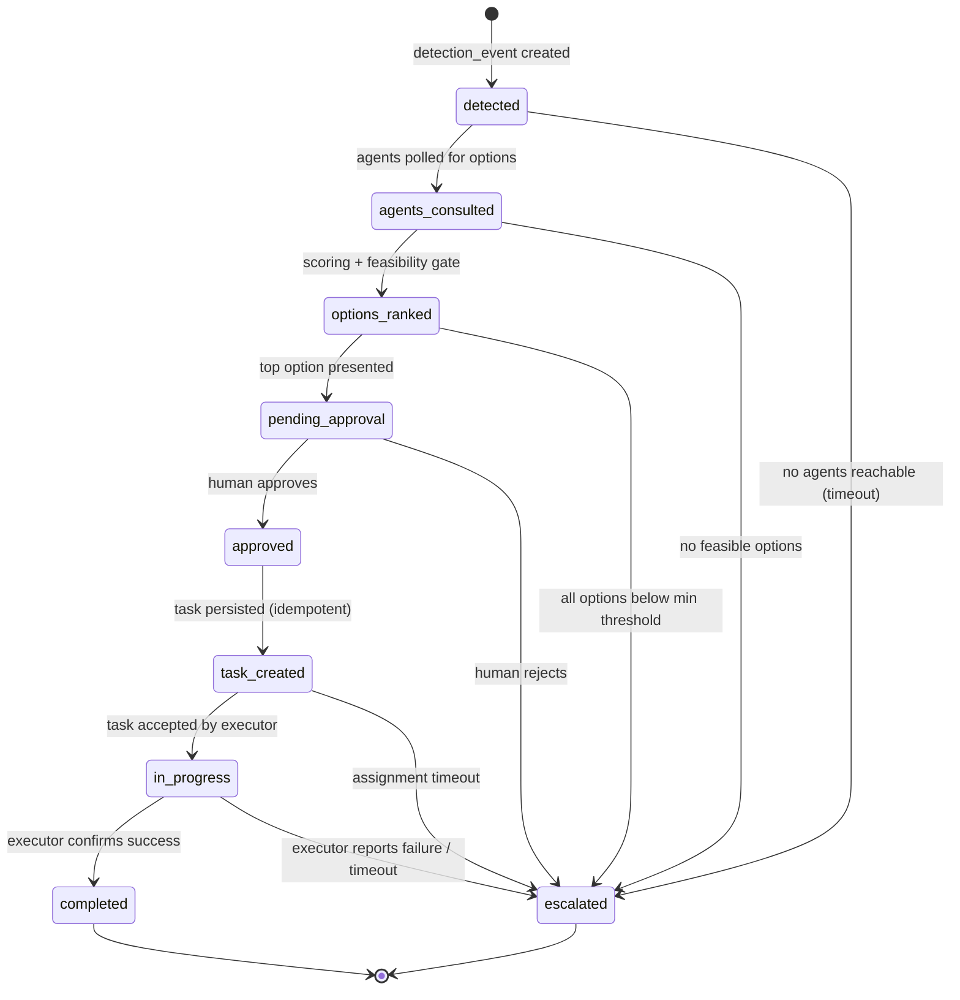
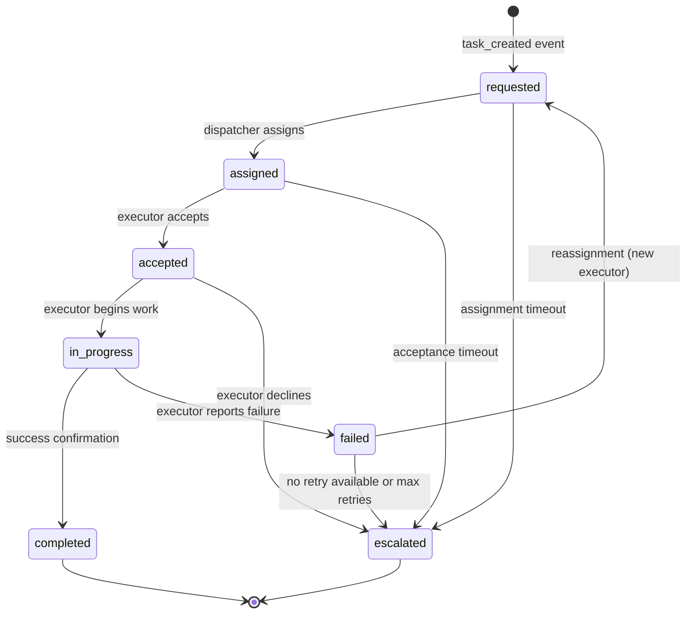

# ADR-002: Orchestrator State Machine Specification

- Status: Accepted
- Date: 2026-07-17
- Scope: Orchestrator workflow state transitions, persistence, recovery

## Context

The Orchestrator coordinates Inventory, Procurement, and Delivery
agents through a named, persisted state machine (FR-03). This ADR
documents the full state transition graph, allowed transitions,
persistence rules, and recovery behaviour.

## State Machine Diagram (Mermaid)



## Allowed Transitions (exhaustive)

| # | From               | To                 | Trigger                                   |
|---|--------------------|--------------------|-------------------------------------------|
| 1 | detected           | agents_consulted   | Agent polling complete                    |
| 2 | detected           | escalated          | Agent polling timeout / all agents failed |
| 3 | agents_consulted   | options_ranked     | Feasibility + scoring complete            |
| 4 | agents_consulted   | escalated          | Zero feasible options                     |
| 5 | options_ranked     | pending_approval   | Top recommendation created                |
| 6 | options_ranked     | escalated          | All scores below minimum threshold        |
| 7 | pending_approval   | approved           | Human approval received                   |
| 8 | pending_approval   | escalated          | Human rejection received                  |
| 9 | approved           | task_created        | Task record persisted                    |
|10 | task_created       | in_progress         | Executor accepts task                    |
|11 | task_created       | escalated           | Assignment timeout                       |
|12 | in_progress        | completed           | Executor confirms completion             |
|13 | in_progress        | escalated           | Executor failure / timeout               |

No other transitions are valid. Any attempt to transition outside this
table must be rejected and logged as an error.

## Delivery Task Sub-State Machine

Tasks have their own state machine (distinct from the Orchestrator):



## Persistence Rules

1. State is written to `orchestrator_workflows.current_state` and
   `orchestrator_state_log` **before** the action for the new state
   begins (write-then-act pattern).
2. If the process crashes after writing state but before acting, on
   restart the workflow resumes from the persisted state and
   re-attempts the action. This is safe because:
   - Actions are idempotent (guarded by `correlation_id` unique
     constraints).
   - Task creation uses `correlation_id = recommendation_id + version`
     as the idempotency key.
   - Inventory movements are only created on `completed` and are keyed
     by `correlation_id + movement_type`.
3. Recovery procedure: on worker startup, query all workflows where
   `current_state NOT IN ('completed', 'escalated')` and resume.

## Observability

Every transition emits a structured JSON log to stdout:

```json
{
  "correlation_id": "uuid",
  "workflow_state": "to_state",
  "from_state": "from_state",
  "medication_id": "uuid",
  "location_id": "uuid",
  "timestamp_utc": "ISO-8601",
  "duration_ms": 0,
  "actor": "module_name",
  "event_type": "state_transition",
  "demand_signal_source": "ml_forecast | deterministic_baseline"
}
```

## Consequences

- The exhaustive transition table enables static validation: a unit
  test can assert no code path attempts an illegal transition.
- Write-then-act guarantees at-least-once semantics; combined with
  idempotency keys, this yields effectively-once execution.
- The separate delivery task state machine allows task-level retry
  (reassignment) without restarting the entire orchestrator workflow.
